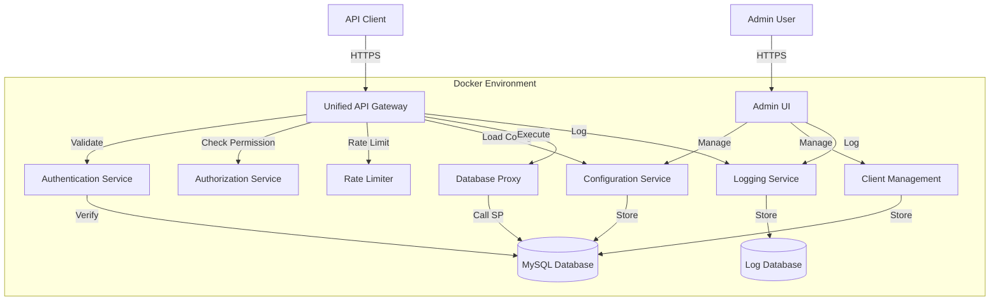

# Design Document - Dynamic API Manager

## Overview

Dynamic API Manager 是一個基於 Laravel 框架的動態 API 管理平台，允許管理員通過 Web UI 動態配置 API 端點，而無需修改程式碼。系統採用微服務架構，運行在 Docker 容器環境中，提供統一的 API Gateway 來路由所有客戶端請求到對應的資料庫 Stored Procedure。

### Key Features

- 動態 API 配置：通過 UI 創建和管理 API Function
- 統一 API Gateway：單一入口點處理所有 API 請求
- Stored Procedure 映射：將 API 請求直接映射到資料庫邏輯
- 多層驗證機制：支援 API Key、Bearer Token 和 OAuth 2.0
- 權限控制：基於角色和客戶端的細粒度權限管理
- 容器化部署：完整的 Docker 環境配置

## Architecture

### System Architecture Diagram



### Technology Stack

- **Backend Framework**: Laravel 10.x
- **Database**: MySQL 8.0
- **Cache**: Redis 7.x
- **Container**: Docker & Docker Compose
- **Web Server**: Nginx
- **PHP**: PHP 8.2 FPM
- **Frontend (Admin UI)**: Laravel Blade + Vue.js 3
- **Authentication**: Laravel Sanctum / Passport

## Components and Interfaces

### 1. Unified API Gateway

**Purpose**: 統一的 API 入口點，負責路由、驗證、授權和執行所有 API 請求

**Responsibilities**:
- 接收和解析客戶端請求
- 驗證 API 憑證
- 檢查權限和速率限制
- 載入 API Function 配置
- 執行參數驗證
- 調用 Stored Procedure
- 格式化回應

**API Endpoint**:
```
POST /api/v1/execute
Content-Type: application/json
Authorization: Bearer {token} | X-API-Key: {api_key}

Request Body:
{
  "function": "user.create",
  "params": {
    "name": "John Doe",
    "email": "john@example.com"
  }
}

Response:
{
  "success": true,
  "data": {
    "user_id": 123,
    "created_at": "2025-10-21T10:30:00Z"
  },
  "meta": {
    "execution_time": 0.045
  }
}
```

**Key Classes**:
- `ApiGatewayController`: 主要控制器
- `RequestValidator`: 請求驗證器
- `FunctionExecutor`: Function 執行器
- `ResponseFormatter`: 回應格式化器

### 2. Authentication Service

**Purpose**: 處理所有驗證相關邏輯

**Supported Methods**:
- **Bearer Token**: JWT-based token authentication
- **API Key**: Static API key in header
- **OAuth 2.0**: Third-party OAuth integration

**Key Classes**:
- `AuthenticationManager`: 驗證管理器
- `TokenValidator`: Token 驗證器
- `ApiKeyValidator`: API Key 驗證器
- `OAuthProvider`: OAuth 提供者

**Database Tables**:
```sql
api_clients (
  id, name, client_type, api_key, 
  secret, token_expires_at, is_active,
  rate_limit, created_at, updated_at
)

api_tokens (
  id, client_id, token, type,
  expires_at, last_used_at, created_at
)
```

### 3. Authorization Service

**Purpose**: 管理權限控制和存取規則

**Key Classes**:
- `AuthorizationManager`: 授權管理器
- `PermissionChecker`: 權限檢查器
- `RoleManager`: 角色管理器

**Database Tables**:
```sql
roles (
  id, name, description, created_at, updated_at
)

permissions (
  id, resource_type, resource_id, 
  action, created_at, updated_at
)

role_permissions (
  role_id, permission_id
)

client_roles (
  client_id, role_id
)

function_permissions (
  function_id, client_id, allowed
)
```

### 4. Configuration Service

**Purpose**: 管理 API Function 的配置資料

**Key Classes**:
- `FunctionRepository`: Function 資料存取
- `ParameterRepository`: 參數資料存取
- `ConfigurationCache`: 配置快取管理

**Database Tables**:
```sql
api_functions (
  id, name, identifier, description,
  stored_procedure, is_active, 
  created_by, created_at, updated_at
)

function_parameters (
  id, function_id, name, data_type,
  is_required, default_value, validation_rules,
  sp_parameter_name, position, created_at, updated_at
)

function_responses (
  id, function_id, field_name, 
  sp_column_name, data_type, 
  transform_rule, created_at, updated_at
)

function_error_mappings (
  id, function_id, error_code,
  http_status, error_message, created_at, updated_at
)
```

### 5. Database Proxy

**Purpose**: 安全地執行 Stored Procedure 並處理結果

**Key Classes**:
- `StoredProcedureExecutor`: SP 執行器
- `ParameterMapper`: 參數映射器
- `ResultTransformer`: 結果轉換器

**Features**:
- Connection pooling
- Transaction management
- Error handling and retry logic
- Query timeout protection

### 6. Rate Limiter

**Purpose**: 控制 API 請求頻率，防止濫用

**Implementation**: Redis-based sliding window algorithm

**Key Classes**:
- `RateLimiter`: 速率限制器
- `ThrottleMiddleware`: 限流中介軟體

**Configuration**:
```php
// Per client rate limits
'rate_limits' => [
    'default' => '60/minute',
    'premium' => '1000/minute',
    'enterprise' => '10000/minute'
]
```

### 7. Admin UI

**Purpose**: 提供 Web 介面管理 API Functions 和系統配置

**Key Pages**:
- Dashboard: 系統概覽和統計
- API Functions: Function 列表和管理
- Function Editor: 創建/編輯 Function
- Clients: API 客戶端管理
- Permissions: 權限配置
- Logs: 請求日誌查詢
- Settings: 系統設定

**Key Components** (Vue.js):
- `FunctionList.vue`: Function 列表
- `FunctionEditor.vue`: Function 編輯器
- `ParameterBuilder.vue`: 參數建構器
- `StoredProcedureSelector.vue`: SP 選擇器
- `ResponseMapper.vue`: 回應映射器
- `ClientManager.vue`: 客戶端管理器

### 8. Logging Service

**Purpose**: 記錄所有 API 請求、錯誤和系統事件

**Log Types**:
- API Request Logs
- Error Logs
- Security Logs (authentication failures, permission denials)
- Audit Logs (configuration changes)

**Key Classes**:
- `ApiLogger`: API 日誌記錄器
- `SecurityLogger`: 安全日誌記錄器
- `AuditLogger`: 審計日誌記錄器

**Database Tables**:
```sql
api_request_logs (
  id, client_id, function_id, 
  request_data, response_data, 
  http_status, execution_time,
  ip_address, user_agent,
  created_at
)

error_logs (
  id, type, message, stack_trace,
  context, created_at
)

security_logs (
  id, event_type, client_id, 
  ip_address, details, created_at
)

audit_logs (
  id, user_id, action, resource_type,
  resource_id, old_value, new_value,
  created_at
)
```

## Data Models

### Core Models

#### ApiFunction Model
```php
class ApiFunction extends Model
{
    protected $fillable = [
        'name', 'identifier', 'description',
        'stored_procedure', 'is_active', 'created_by'
    ];
    
    public function parameters()
    {
        return $this->hasMany(FunctionParameter::class);
    }
    
    public function responses()
    {
        return $this->hasMany(FunctionResponse::class);
    }
    
    public function errorMappings()
    {
        return $this->hasMany(FunctionErrorMapping::class);
    }
    
    public function permissions()
    {
        return $this->hasMany(FunctionPermission::class);
    }
}
```

#### FunctionParameter Model
```php
class FunctionParameter extends Model
{
    protected $fillable = [
        'function_id', 'name', 'data_type',
        'is_required', 'default_value', 'validation_rules',
        'sp_parameter_name', 'position'
    ];
    
    protected $casts = [
        'is_required' => 'boolean',
        'validation_rules' => 'array'
    ];
    
    public function function()
    {
        return $this->belongsTo(ApiFunction::class);
    }
}
```

#### ApiClient Model
```php
class ApiClient extends Model
{
    protected $fillable = [
        'name', 'client_type', 'api_key',
        'secret', 'token_expires_at', 'is_active',
        'rate_limit'
    ];
    
    protected $hidden = ['secret'];
    
    protected $casts = [
        'is_active' => 'boolean',
        'token_expires_at' => 'datetime'
    ];
    
    public function tokens()
    {
        return $this->hasMany(ApiToken::class);
    }
    
    public function roles()
    {
        return $this->belongsToMany(Role::class, 'client_roles');
    }
}
```

### Data Type Support

支援的參數資料類型：
- `string`: 字串
- `integer`: 整數
- `float`: 浮點數
- `boolean`: 布林值
- `date`: 日期 (Y-m-d)
- `datetime`: 日期時間 (Y-m-d H:i:s)
- `json`: JSON 物件
- `array`: 陣列

### Validation Rules

支援的驗證規則（Laravel Validation）：
- `required`, `nullable`
- `min:value`, `max:value`
- `email`, `url`
- `regex:pattern`
- `in:value1,value2`
- `numeric`, `alpha`, `alpha_num`
- Custom validation rules

## Error Handling

### Error Response Format

```json
{
  "success": false,
  "error": {
    "code": "VALIDATION_ERROR",
    "message": "參數驗證失敗",
    "details": {
      "email": ["email 格式不正確"]
    }
  },
  "meta": {
    "request_id": "req_abc123",
    "timestamp": "2025-10-21T10:30:00Z"
  }
}
```

### Error Codes

| Code | HTTP Status | Description |
|------|-------------|-------------|
| AUTHENTICATION_REQUIRED | 401 | 缺少驗證憑證 |
| INVALID_CREDENTIALS | 401 | 驗證憑證無效 |
| TOKEN_EXPIRED | 401 | Token 已過期 |
| PERMISSION_DENIED | 403 | 權限不足 |
| FUNCTION_NOT_FOUND | 404 | API Function 不存在 |
| FUNCTION_DISABLED | 403 | API Function 已停用 |
| VALIDATION_ERROR | 400 | 參數驗證失敗 |
| RATE_LIMIT_EXCEEDED | 429 | 超過請求頻率限制 |
| STORED_PROCEDURE_ERROR | 500 | Stored Procedure 執行錯誤 |
| DATABASE_ERROR | 500 | 資料庫錯誤 |
| INTERNAL_ERROR | 500 | 內部伺服器錯誤 |

### Exception Handling Strategy

```php
// Global exception handler
class Handler extends ExceptionHandler
{
    protected $dontReport = [
        ValidationException::class,
        AuthenticationException::class,
        AuthorizationException::class,
    ];
    
    public function render($request, Throwable $exception)
    {
        if ($request->is('api/*')) {
            return $this->handleApiException($request, $exception);
        }
        
        return parent::render($request, $exception);
    }
    
    private function handleApiException($request, $exception)
    {
        // Map exceptions to error responses
        // Log errors
        // Return formatted JSON response
    }
}
```

## Testing Strategy

### Unit Tests

**Target**: 個別類別和方法的邏輯測試

**Coverage**:
- `RequestValidator`: 參數驗證邏輯
- `ParameterMapper`: 參數映射邏輯
- `ResponseFormatter`: 回應格式化邏輯
- `AuthenticationManager`: 驗證邏輯
- `PermissionChecker`: 權限檢查邏輯

**Tools**: PHPUnit

### Integration Tests

**Target**: 元件間的整合測試

**Coverage**:
- API Gateway 完整流程（驗證 → 授權 → 執行 → 回應）
- Database Proxy 與資料庫的互動
- Configuration Service 的快取機制
- Rate Limiter 的限流邏輯

**Tools**: PHPUnit + Laravel Testing

### API Tests

**Target**: 端到端 API 測試

**Coverage**:
- 統一 API Gateway 的各種請求場景
- 不同驗證方式的測試
- 權限控制測試
- 錯誤處理測試
- Rate limiting 測試

**Tools**: PHPUnit + Laravel HTTP Tests

### Admin UI Tests

**Target**: 前端介面測試

**Coverage**:
- Function CRUD 操作
- 參數配置介面
- 客戶端管理介面
- 權限配置介面

**Tools**: Laravel Dusk (Browser Testing)

## Security Considerations

### 1. Authentication Security

- 使用 HTTPS 加密所有通訊
- Token 採用 JWT 標準，包含過期時間
- API Key 使用安全的隨機生成器
- 支援 Token 撤銷機制
- 密碼和 Secret 使用 bcrypt 加密儲存

### 2. Authorization Security

- 實施最小權限原則
- 預設拒絕所有存取，明確授權才允許
- 定期審查權限配置
- 記錄所有權限變更

### 3. Input Validation

- 嚴格驗證所有輸入參數
- 防止 SQL Injection（使用 Prepared Statements）
- 防止 XSS 攻擊（輸出編碼）
- 限制請求大小和複雜度

### 4. Rate Limiting

- 實施多層次速率限制
- 防止 DDoS 攻擊
- 保護資料庫資源

### 5. Logging and Monitoring

- 記錄所有安全相關事件
- 監控異常請求模式
- 設定告警機制

## Docker Configuration

### Docker Compose Structure

```yaml
version: '3.8'

services:
  app:
    build:
      context: .
      dockerfile: docker/Dockerfile
    container_name: api-server
    volumes:
      - ./:/var/www/html
    environment:
      - APP_ENV=production
      - DB_HOST=mysql
      - REDIS_HOST=redis
    depends_on:
      - mysql
      - redis
    networks:
      - app-network

  nginx:
    image: nginx:alpine
    container_name: nginx
    ports:
      - "80:80"
      - "443:443"
    volumes:
      - ./:/var/www/html
      - ./docker/nginx/conf.d:/etc/nginx/conf.d
    depends_on:
      - app
    networks:
      - app-network

  mysql:
    image: mysql:8.0
    container_name: mysql
    environment:
      - MYSQL_ROOT_PASSWORD=${DB_ROOT_PASSWORD}
      - MYSQL_DATABASE=${DB_DATABASE}
      - MYSQL_USER=${DB_USERNAME}
      - MYSQL_PASSWORD=${DB_PASSWORD}
    volumes:
      - mysql-data:/var/lib/mysql
      - ./docker/mysql/init:/docker-entrypoint-initdb.d
    networks:
      - app-network

  redis:
    image: redis:7-alpine
    container_name: redis
    volumes:
      - redis-data:/data
    networks:
      - app-network

networks:
  app-network:
    driver: bridge

volumes:
  mysql-data:
  redis-data:
```

### Environment Variables

```env
APP_NAME="Dynamic API Manager"
APP_ENV=production
APP_KEY=
APP_DEBUG=false
APP_URL=https://api.example.com

DB_CONNECTION=mysql
DB_HOST=mysql
DB_PORT=3306
DB_DATABASE=api_manager
DB_USERNAME=api_user
DB_PASSWORD=

REDIS_HOST=redis
REDIS_PASSWORD=null
REDIS_PORT=6379

CACHE_DRIVER=redis
SESSION_DRIVER=redis
QUEUE_CONNECTION=redis

LOG_CHANNEL=stack
LOG_LEVEL=info
```

## Performance Optimization

### 1. Caching Strategy

- **Configuration Cache**: 快取 API Function 配置（Redis）
- **Permission Cache**: 快取權限檢查結果
- **Database Query Cache**: 快取常用查詢結果
- **Response Cache**: 快取不常變動的 API 回應

### 2. Database Optimization

- 為常用查詢欄位建立索引
- 使用 Connection Pooling
- 實施 Query 優化
- 定期清理舊日誌資料

### 3. API Gateway Optimization

- 使用非同步處理非關鍵任務（日誌記錄）
- 實施請求批次處理
- 優化參數驗證流程

## Deployment Strategy

### Development Environment

- 使用 Docker Compose 本地開發
- 啟用 Debug 模式
- 使用測試資料庫

### Staging Environment

- 模擬生產環境配置
- 執行完整測試套件
- 效能測試和壓力測試

### Production Environment

- 使用 Docker Swarm 或 Kubernetes
- 實施 Blue-Green Deployment
- 配置自動擴展
- 設定監控和告警
- 定期備份資料庫

## Migration Path

### Phase 1: Core Infrastructure
- 建立 Docker 環境
- 設定 Laravel 專案
- 建立資料庫 Schema
- 實作基本的 CRUD API

### Phase 2: API Gateway
- 實作統一 API Gateway
- 實作 Stored Procedure 執行器
- 實作參數驗證和映射
- 實作回應格式化

### Phase 3: Authentication & Authorization
- 實作多種驗證機制
- 實作權限控制系統
- 實作 Rate Limiting

### Phase 4: Admin UI
- 建立 Admin UI 框架
- 實作 Function 管理介面
- 實作客戶端管理介面
- 實作日誌查詢介面

### Phase 5: Testing & Optimization
- 撰寫測試套件
- 效能優化
- 安全加固
- 文件完善
